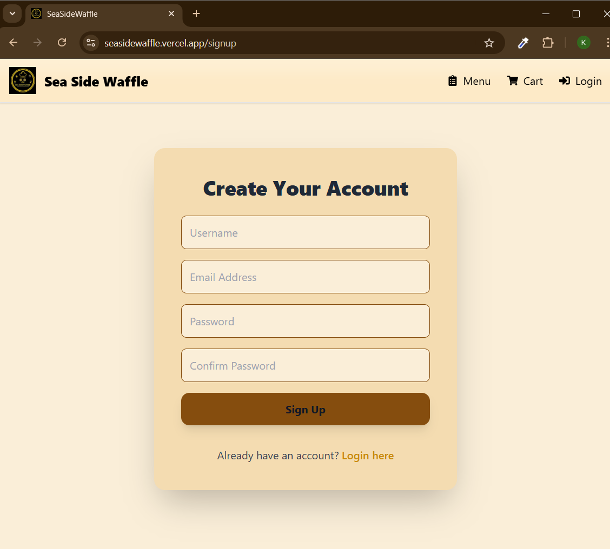
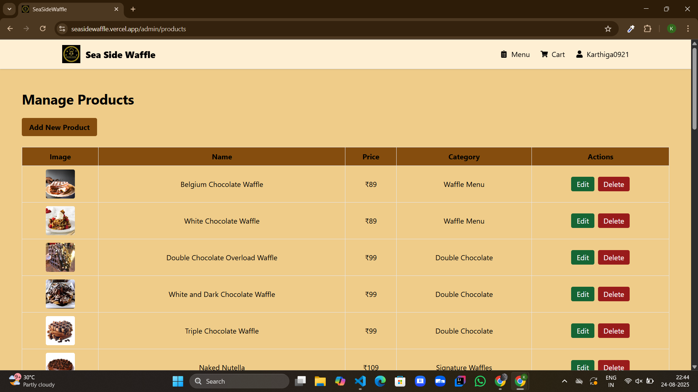

# 🧇 Sea Side Waffle [Live Site](https://seasidewaffle.vercel.app/)

Sea Side Waffle is a **full-stack e-commerce web application** built using the **MERN stack** with Firebase authentication.  
It allows customers to browse and order waffles online, while admins can manage products, users, and orders via a secure dashboard.  


## Live Links  

- **Frontend (Client):** [Sea Side Waffle Client](https://seasidewaffle.vercel.app)  
- **Backend (API):** [Sea Side Waffle Server](https://seasidewaffle-server.onrender.com)  


## Screenshots  

### User Pages  
| Homepage | Menu | Product Details | Cart | Checkout |
|----------|------|-----------------|------|----------|
|  |  |  |  |  |

| Login | Signup | Favourites | Profile | Orders |
|-------|--------|------------|---------|--------|
|  |  |  |  |  |

### Admin Pages  
| Admin Dashboard | Manage Products | Manage Orders | Manage Users |
|-----------------|-----------------|---------------|--------------|
|  |  |  |  |

## Features  

### User Features  
- Firebase authentication (login/signup)  
- Browse waffles by category  
- Product details with images, description, and ingredients  
- Add products to **Cart** and update quantities  
- Add/remove **Favourites**  
- Place orders with checkout flow  
- Profile management & view past orders  

### Admin Features  
- Admin dashboard with secure login  
- Manage products (add, edit, delete with image uploads)  
- Manage orders (track & update status)  
- Manage users  


## Tech Stack  

**Frontend (Client):**  
- React (Vite)  
- Tailwind CSS  
- Firebase Authentication  
- Context API for state management  

**Backend (Server):**  
- Node.js + Express.js  
- MongoDB + Mongoose  
- Multer (image uploads)  
- JWT Authentication  
- Nodemailer (order email service)  

**Deployment:**  
- Frontend → Vercel  
- Backend → Render  


## Project Structure  

Sea Side Waffle/
├── client/                 # React Frontend
│   ├── components/         # Reusable components (Navbar, Footer, ProductCard, etc.)
│   ├── pages/              # Application pages (Home, Menu, Cart, Checkout, Admin, etc.)
│   ├── utils/              # Helpers (cart.js, apiConfig.js)
│   ├── assets/             # Static assets (logo, hero image)
│   └── Screenshots/        # Screenshots for documentation
│
├── server/                 # Node/Express Backend
│   ├── controllers/        # Business logic (Products, Orders, Users, Cart)
│   ├── models/             # Mongoose schemas
│   ├── routes/             # API routes
│   ├── middleware/         # Auth middleware
│   ├── services/           # Email services
│   ├── uploads/            # Uploaded product images
│   └── server.js           # Entry point

## Installation  

### Clone the repository  
```bash
git clone https://github.com/KarthigaP20/seasidewaffle.git
cd seasidewaffle

Install dependencies

Backend
cd server
npm install

Frontend
cd ../client
npm install

Configure Environment Variables

In server/.env
PORT=5000
MONGO_URI=your_mongodb_uri
JWT_SECRET=your_secret_key
EMAIL_USER=your_email
EMAIL_PASS=your_email_password
CLIENT_URL=https://seasidewaffle.vercel.app

In client/.env
VITE_API_URL=https://seasidewaffle-server.onrender.com

Run the project

Backend
cd server
node server.js

Frontend
cd client
npm run dev

Now visit: http://localhost:5173

## Author

**Karthiga P**  
- Full Stack Developer  
- GitHub: [KarthigaP20](https://github.com/KarthigaP20)  

## Feedback & Thank You

Thank you for visiting and exploring the Sea Side Waffle project.
If you have suggestions or feedback, feel free to reach out via GitHub.
Your input is always appreciated!

